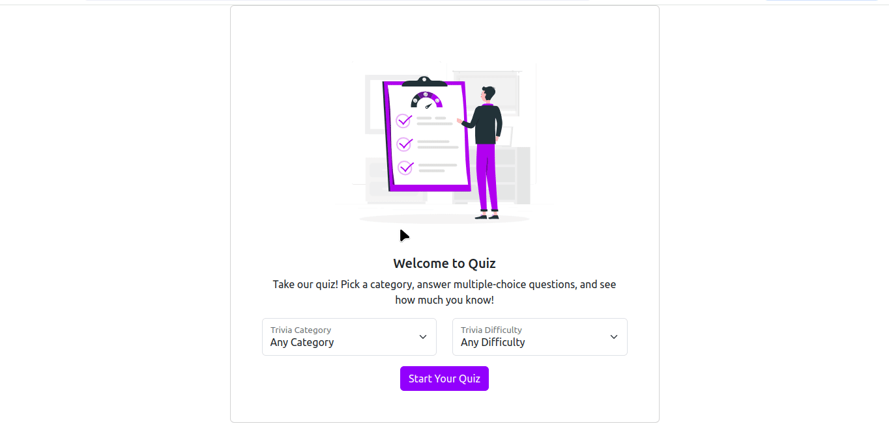

# React Quiz App

This is a React-based quiz application that fetches trivia questions from the [Open Trivia Database](https://opentdb.com/). Users can select a category and difficulty level to start the quiz. The app keeps track of the user's score and provides feedback based on the performance.

## Features

- **Trivia Questions:** The app fetches trivia questions from the [Open Trivia Database](https://opentdb.com/).
- **Customizable Quiz:** Users can select a category and difficulty level for their quiz.
- **Timed Quizzes:** Each quiz session has a time limit. If the time runs out, the quiz automatically ends.
- **Scoring System:** The app calculates the score and shows the results at the end of the quiz.
- **Responsive Design:** The app is designed to be responsive and works well on various screen sizes.

## Demo

You can try out the live demo of the React Quiz App here:

[Live Demo](https://tegarsubkhan236.github.io/react-quiz-app)

## API Reference

The application uses the [Open Trivia Database API](https://opentdb.com/api_config.php) to fetch trivia questions. You can customize the number of questions, category, and difficulty through the API.